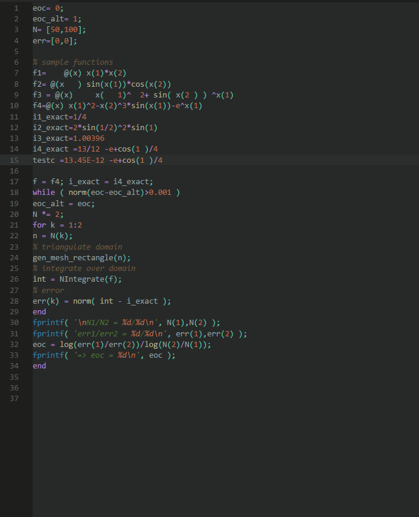

# matlab-formatter README

matlab-formatter provides a python script to format matlab-code as well as the required VScode api

## Requirements
- python 3

## Extension Settings
* `matlab-formatter.path`: absolute path to matlab_formatter.py which is also included in this package (e.g. /home/me/.vscode/extensions/matlab-formatter/formatter/matlab_formatter.py)
* `matlab-formatter.indentwidth`: number of spaces used for indentation
